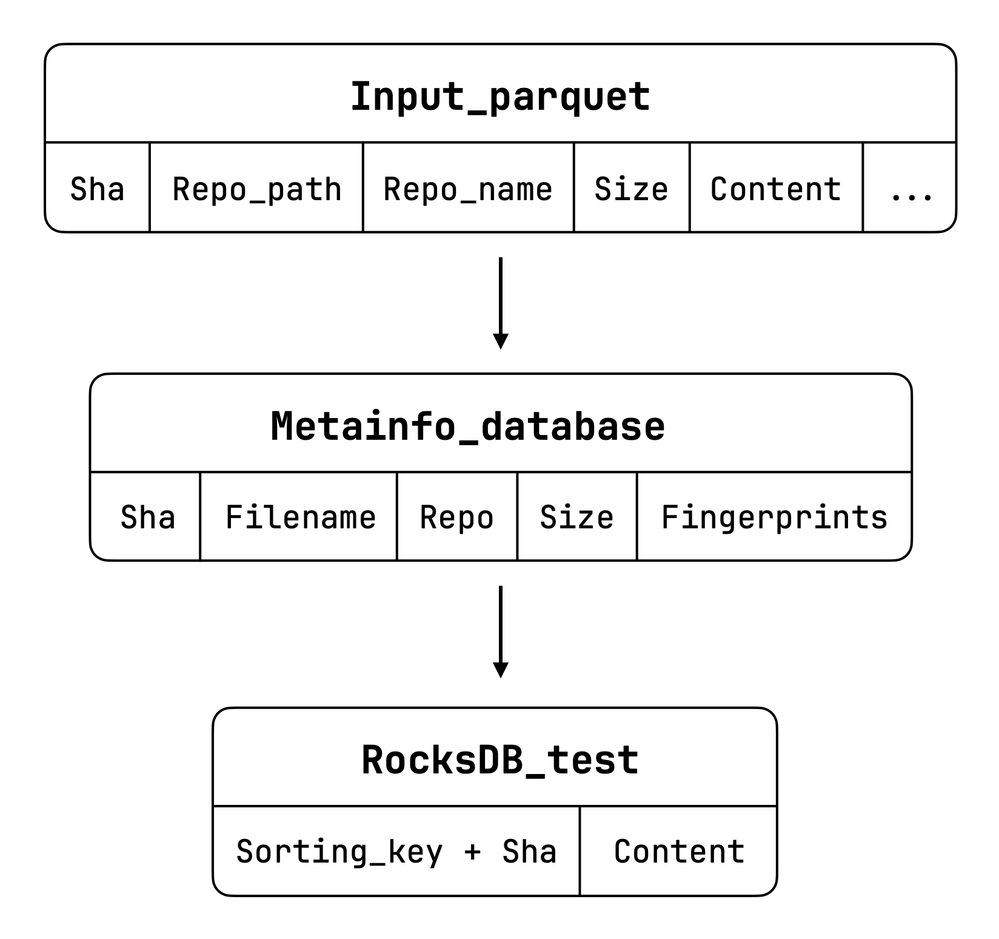

# PPC The Stack into RocksDB

This repo contains the Python code used to test the Permute-Partition-Compress paradigm on Software Heritage and RocksDB. We used Software Heritage code hosted by Hugging Face at [the-stack-v1-dedup](https://huggingface.co/datasets/bigcode/the-stack-dedup), permuted it using different heuristics and created various RocksDB databases to test their differences and performances.

The benchmark architecture is the following. At the beginning we read the entire the-stack parquet (without the content of the files) and produce  a pandas dataframe, that we will sort differently based on predefined functions. Than, for each element in the sorted dataframe, we get the content of the file from the contents txt and, after accurately creating the related key, we insert it in a RocksDB. 

The repository is structured as follows:
- `benchmark-pre_sorted.py` and `benchmark-not_sorted.py` are the benchmarks written in python
- `create_contents.py` is an auxiliary files needed to setup the environment
- `scripts/` contains the files needed for testing smaller things that we used in the development process and may still provide useful for future use
- `utils/` contains some utility files, like the toy ones used for basic testing

The entire code is tested with Python version 3.11.9, but may be executed also with 3.10.

## Documentation and options
Sorting options:
- `filename_boffa`: only sort by reversed filename
- `filename_tosoni`: reversed order, not reversed words
- `tosoni_nopath`: same as above, but the path is excluded
- `filename_repo`: first sort by filename (reversed, so that all file with the same extension go together), than by repo if the filename is the same
- `repo_filename`: first sort by repo, than by reversed filename
- `tlsh`: sort by tlsh fingerprint (locality-sensitive hashing), than by size if the fingerprint is the same.

## Development environment setup
The repo contains two files for the benchmark:
- `benchmark-pre_sorted.py` that represents the standard benchmark, in which we sort the record before inserting into RocksDB
- `benchmark-not_sorted.py` that, differently from the other benchmark, doesn't sort the elements, interting into RocksDB as we read it from a stream of data. In this way, we rely on the storage engine to keep data ordered by key

In order to download the repo and setup the virtual environment, you need to run these commands:
```bash
git clone https://github.com/0xfederama/ppc-swh-rocksdb
cd ppc-swh-rocksdb
python3 -m venv venv
source venv/bin/activate
pip install -r requirements.txt
```

On the machine we used, everything should already be setup for the usage and only the things specified above are necessary. Otherwise, follow the next section. After installing the dataset, look at the _run_ section below.

### Download the datasets
The benchmark can be executed on any Parquet file with at least these columns: `["hexsha", "max_stars_repo_path", "max_stars_repo_name", "content", "size", "lang"]`. As we did ourselves, it's very easy to remodel a dataset to execute it with our benchmarks, simply renaming the Parquet columns is necessary. Otherwise, to download a ready-made dataset like [the-stack-v1-dedup](https://huggingface.co/datasets/bigcode/the-stack-dedup), you can follow HuggingFace's guide to install the dataset and export it to Parquet. For information, the code is the following, but be sure to download the proper libraries for HuggingFace:
```python
from datasets import load_dataset

dataset = load_dataset("bigcode/the-stack-dedup")
dataset.to_parquet("path/to/file.parquet")
```

**If you only aim to test `benchmark-not_sorted.py`, you can skip this next part.**

After downloading the dataset, you need to create two auxiliary files: `contents.txt` and `contents-index.json`. The former contains the contents of all the files of the dataset, and the second one is its index with starting and ending positions to get the specific file contents. These files are as big as the datasets, but are needed only with the `benchmark-pre_sorted.py`, in which we cannot sort the entire dataframe, contents included. The two files can be created simply by running `python3 create_contents.py`, changing the paths with yours in the first lines of the file.

At this point, you should have everything set up and ready to run the benchmark.

### Run the benchmark
As already said, the benchmarks are `benchmark-pre_sorted.py` and `benchmark-not_sorted.py`. They both read from `config.py` file, in which you have to list the paths of the files created in the previous section, the output path for the RocksDB database, and the parameters for the execution of the benchmark (block size, compressor, ordering heuristic). The predefined paths that you find in the file are available to you as a toy test, reading very small parquet and contents file from the `utils/` directory, and the best parameters that we found in our research: 16 kB block size, zlib-6 compressor, ext-filename-nopath order.

Then, after setting up `config.py`, you can execute the code just by running one of these commands:
```bash
python3 benchmark-not_sorted.py
python3 benchmark-pre_sorted.py
```

We strongly recommend using the `nohup` command to run the tests in the background, due to the long execution times required for the benchmarks on larger datasets.