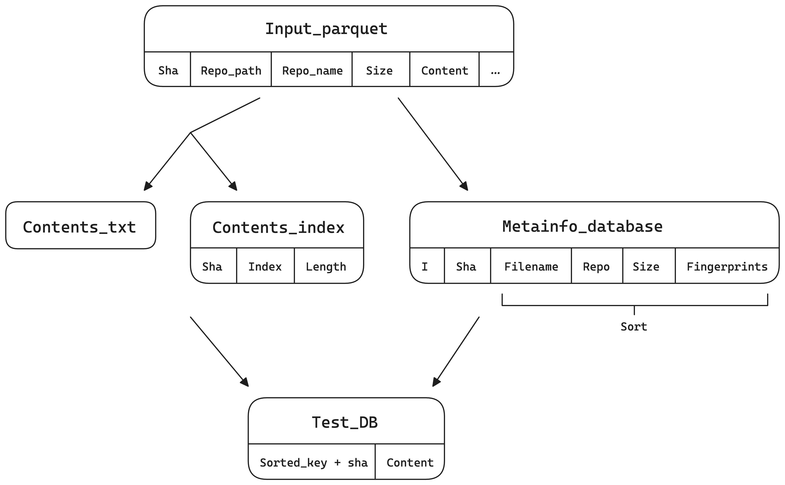

# PPC the-stack into RocksDB

This repo contains the Python code used to test the Permute-Partition-Compress paradigm on Software Heritage and RocksDB. We used Software Heritage code hosted by Hugging Face at [the-stack-dedup](https://huggingface.co/datasets/bigcode/the-stack-dedup), permuted it using different heuristics and created various RocksDB databases to test their differences and performances.

The benchmark `bench_the_stack.py` architecture is the following. At the beginning we read the entire the-stack parquet and produce a metainfo_database (in this case a pandas dataframe), that we will sort differently based on predefined functions. Than, for each element in the sorted dataframe, we get the content of the file from the `contents_db` and, after creating the key of the record, we insert it in a `test_db` in RocksDB. 

Sorting options:
- `filename_repo`: first sort by filename (reversed, so that all file with the same extension go together), than by repo if the filename is the same
- `repo_filename`: first sort by repo, than by reversed filename
- `filename`: only sort by reversed filename
- `fingerprint`: sort by fingerprint (locality-sensitive hashing), than by size if the fingerprint is the same.

Fingerprints:
- `tlsh`

## Usage and run
The repo contains only one main file for the benchmark, that is `bench_the_stack.py` and some utility scripts in the `scripts` directory, that were used in order to get info or gather early results in the project.

To setup and run the benchmark:
```bash
git clone https://github.com/0xfederama/ppc-swh-rocksdb.git
cd ppc-swh-rocksdb
python3 -m venv venv
source venv/bin/activate
pip install -r requirements.txt
./bench_the_stack
```

On the machine we used everything should already be setup for the usage and only the things specified above are necessary. Otherwise, you will also need to download the parquet database from [the-stack-dedup](https://huggingface.co/datasets/bigcode/the-stack-dedup) and create the `contents_db` running `./scripts/create_rocksdb_thestack.py`, following the directions and the comments in that file.

The benchmark is setup with minimal options, so if you want to make it run on other parameters, it is as simple as modifying the last lines in the file `bench_the_stack.py` to enable/disable some options.